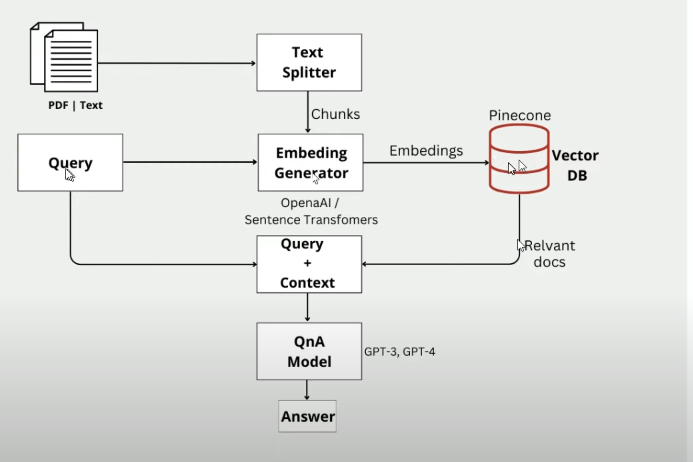

# AI Powered PDF QnA System

The AI Powered PDF QnA System is an advanced solution designed to extract answers to user queries from PDF documents by leveraging the synergy of Langchain, Pinecone, and Streamlit technologies. This application uses cutting-edge natural language processing (NLP) models and vector database indexing for efficient and accurate context-aware answers.

## System Architecture

The system's architecture integrates several key components:

### Components:

- **Text Splitter**: Splits the input PDF or text document into smaller chunks suitable for processing by the embedding generator.

- **Embedding Generator**: Utilizes models from OpenAI or Sentence Transformers to generate embeddings (vector representations) for each text chunk, enabling efficient similarity comparison and retrieval.

- **Pinecone**: A vector database that stores and manages the embeddings of the document chunks. It facilitates the retrieval of the most relevant chunks based on query embeddings.

- **QnA Model**: Employs advanced question answering models like GPT-3 or GPT-4, which use the provided query and context to generate accurate answers.

- **Langchain**: Provides the structure and integration for the QnA model and memory management, ensuring a seamless flow of data and context throughout the system.

- **Streamlit**: Powers the interactive and user-friendly web interface, enabling users to upload documents and enter queries with ease.

### Workflow:

1. Upload the PDF/text document to the system.
2. The document is split into chunks by the Text Splitter.
3. The Embedding Generator creates embeddings for each chunk.
4. Embeddings are stored in the Pinecone vector database.
5. Upon a user query, relevant document chunks are retrieved from Pinecone.
6. The QnA model uses the retrieved context along with the query to generate an answer.

## How to Use

To interact with the AI Powered PDF QnA System:

1. Upload a PDF document through the Streamlit interface.
2. Enter your question in the provided query box.
3. The system processes your query and returns an answer using context from the uploaded document.

## Technologies

This project is built using the following technologies:

- **Langchain**: A library that enables the creation of powerful language applications using LLMs (Large Language Models).

- **Pinecone**: A scalable vector database service that allows for efficient similarity search and data retrieval.

- **Streamlit**: An open-source app framework for Machine Learning and Data Science teams to create beautiful data applications.

## Future Enhancements

- **UI/UX Improvements**: Further enhance the user interface and experience.
- **Model Optimization**: Continuously update the QnA model to incorporate the latest NLP research.
- **Scalability**: Optimize the system to manage larger documents and more simultaneous user queries.

## Contribution

Contributions are welcome! Please fork the repository, make your changes, and submit a pull request with your improvements.

## License

This project is made available under the [MIT License](LICENSE).
